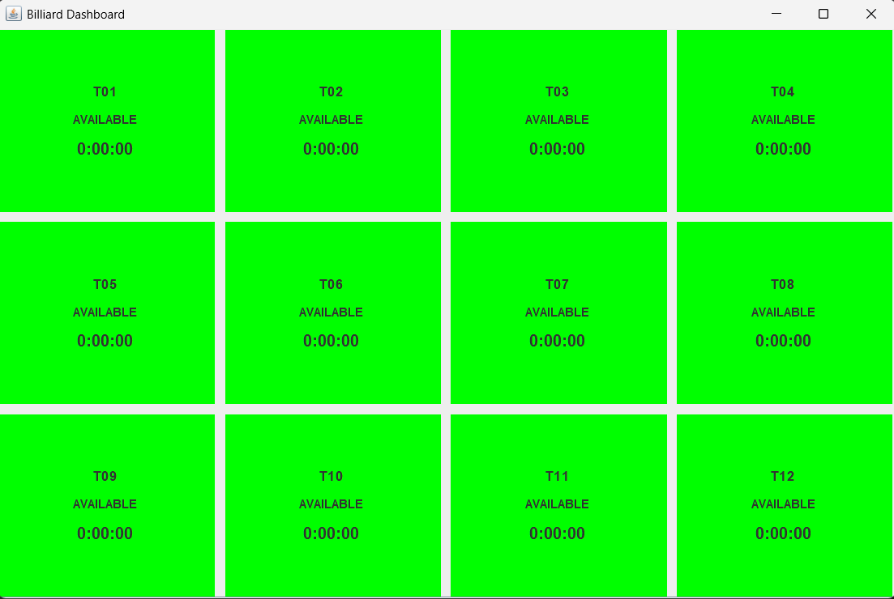
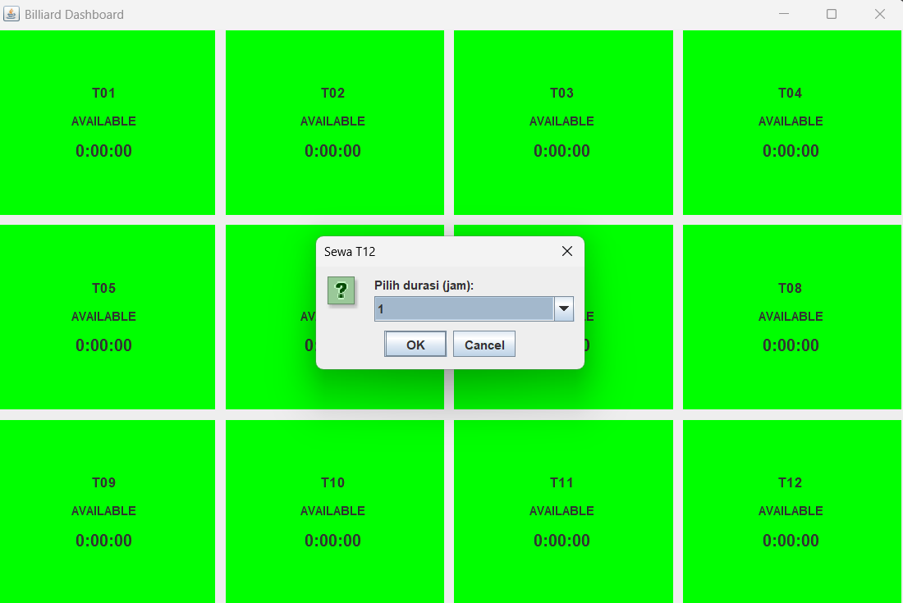
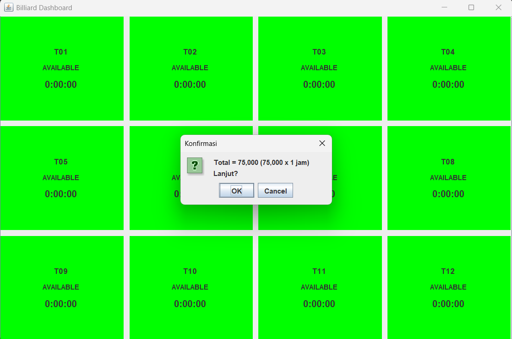
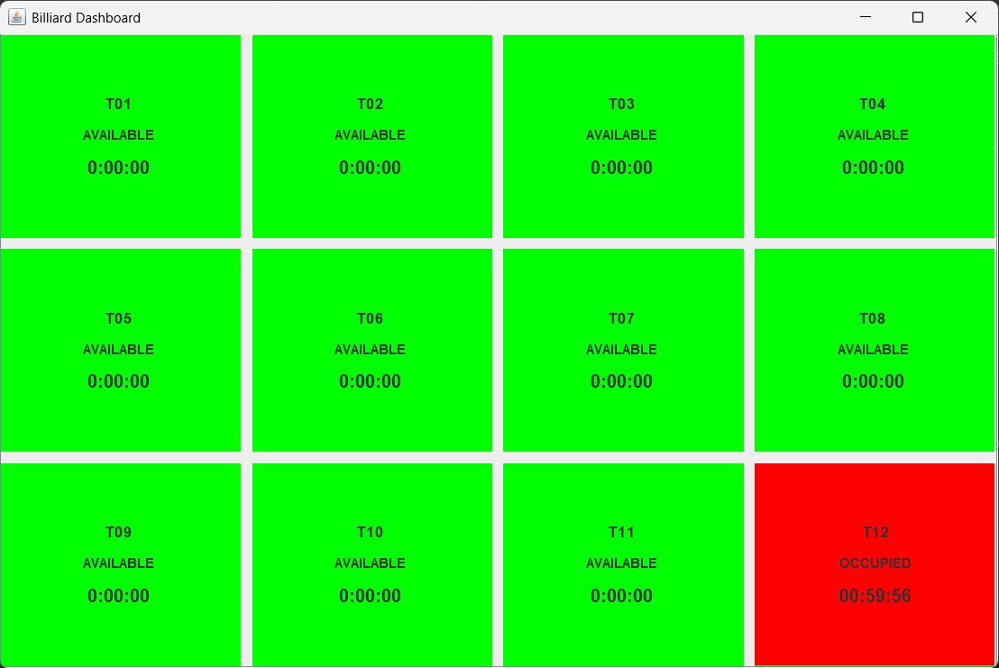
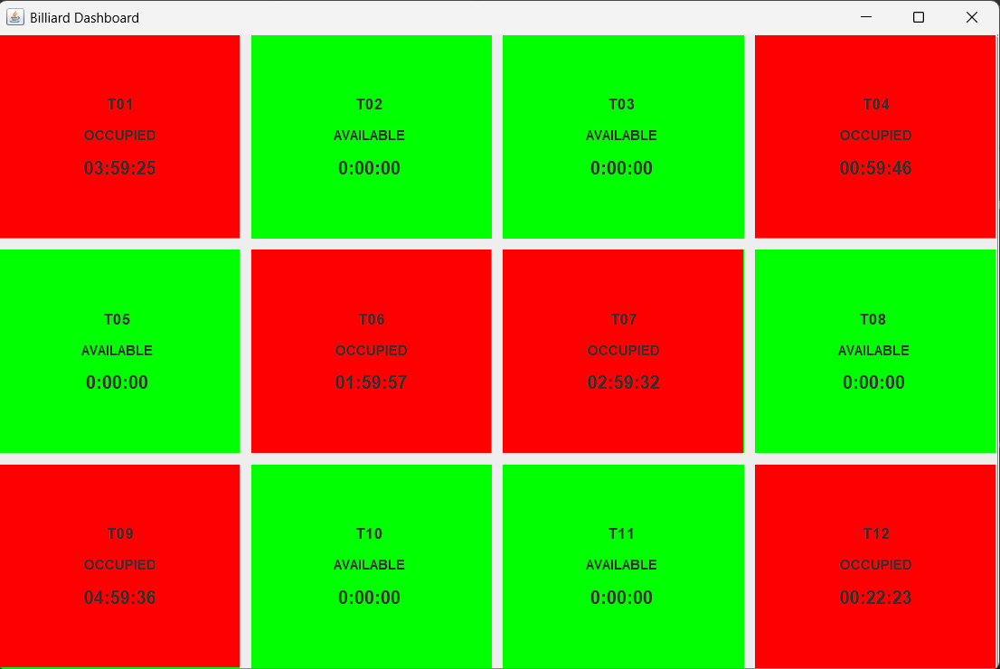
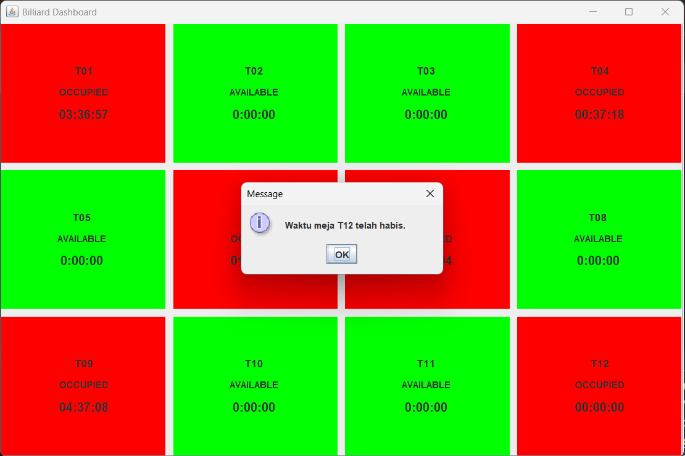

# Thread-DB Simulasi Aplikasi Pemesanan Meja Billiard

## 👤 Identitas

| -------- | --------------------- |
| **Nama** | Muhammad Anshar Putra |
| **NIM**  | F1D02310078           |
| -------- | --------------------- |


## Deskripsi Aplikasi

aplikasi berbasis Java Swing yang dirancang untuk membantu pengelola tempat billiard dalam mengelola penyewaan meja secara mudah, cepat, dan akurat. Aplikasi ini menangani seluruh proses penyewaan meja mulai dari pemilihan meja, pengaturan durasi sewa, perhitungan biaya, hingga pengelolaan status meja secara real-time. Aplikasi dilengkapi dengan timer otomatis berbasis multithreading yang menghitung mundur waktu penyewaan. Timer ini terintegrasi dengan database sehingga tetap berlanjut meskipun aplikasi ditutup dan dibuka kembali, memastikan data penyewaan selalu konsisten. Aplikasi ini juga menerapkan pola MVC & DAO, sehingga struktur kode lebih rapi, modular, dan mudah dikembangkan. Informasi status meja tersimpan dalam database MySQL, sementara tampilan antarmuka dirancang agar kasir atau operator dapat bekerja dengan cepat.

## Pemrosesan Database
```sql
-- 1. membuat database
CREATE DATABASE biliardann;

-- 2. masuk ke database
USE biliardann;

-- 3. membuat tabel billiard_tables
CREATE TABLE billiard_tables (
    id INT AUTO_INCREMENT PRIMARY KEY,
    code VARCHAR(10) UNIQUE,
    status ENUM('AVAILABLE','OCCUPIED') DEFAULT 'AVAILABLE',
    hourly_rate INT NOT NULL DEFAULT 30000,
    created_at TIMESTAMP DEFAULT CURRENT_TIMESTAMP,
    updated_at TIMESTAMP DEFAULT CURRENT_TIMESTAMP ON UPDATE CURRENT_TIMESTAMP
);

-- 4. memasukan jumlah meja yanng diinginkan 
INSERT INTO billiard_tables (code, status, hourly_rate) VALUES
('T01','AVAILABLE',30000), ('T02','AVAILABLE',30000),
('T03','AVAILABLE',30000), ('T04','AVAILABLE',30000),
('T05','AVAILABLE',30000), ('T06','AVAILABLE',30000),
('T07','AVAILABLE',30000), ('T08','AVAILABLE',30000),
('T09','AVAILABLE',30000), ('T10','AVAILABLE',30000),
('T11','AVAILABLE',30000), ('T12','AVAILABLE',30000);

-- 5. membuat tabel rental_sessions
CREATE TABLE rental_sessions (
    id INT AUTO_INCREMENT PRIMARY KEY,
    table_id INT NOT NULL,
    start_time DATETIME NOT NULL,
    end_time DATETIME NOT NULL,
    hourly_rate INT NOT NULL,
    total_amount INT NOT NULL,
    status ENUM('ACTIVE','COMPLETED','CANCELLED') DEFAULT 'ACTIVE',
    created_at TIMESTAMP DEFAULT CURRENT_TIMESTAMP,
    updated_at TIMESTAMP DEFAULT CURRENT_TIMESTAMP ON UPDATE CURRENT_TIMESTAMP,
    FOREIGN KEY (table_id) REFERENCES billiard_tables(id)
);
```
## Mengkofigurasi koneksi DB 

```java
public class DBUtil {
	private static final String url = "jdbc:mysql://localhost:3306/billiardaan";
	private static final String user = "root";
	private static final String pass = "";
	
	public static Connection getConnection () {
		try{
			return DriverManager.getConnection(url, user, pass);
		} catch (Exception e) {
			e.printStackTrace();
			return null;
		}
	}
}
```
## Struktur Folder

```
THREAD-DB/
├── concurrency/
│   └── TimerMeja.java  # modul multithreading yang menangani timer hitung mundur untuk setiap meja billiard.
├── lib/
│   └── mysql-connector-j-8.3.0.jar # Library JDBC untuk koneksi ke MySQL
├── src/
│   ├── dao/  # untuk db
│   │   ├── DBUtil.java  # konfigurasi db
│   │   ├── RentalDAO.java # mengelola operasi db untuk timer nya
│   │   └── TableDAO.java #  mengelola operasi db untuk meja rental         
│   ├── gui/  # untuk tampilan 
│   │   ├── Dashboard.java # menampilkan window utama aplikasi
│   │   └── TableCard.java # Komponen visual untuk setiap meja
│   └── model/  # untuk object
│       ├── Meja.java # inisialisasi objek mejanya 
│       └── RentalSession.java  # inisialisasi objek timernya
└── README.md

```

## Skenario Penggunaan Aplikasi

### Pengguna memilih meja yang "AVAILABLE" dengan berwarna hijau


### pengguna memilih berapa jam meja yang ingin disewakan


### Pengguna mengkonfirmasi jam yang ditentukan, serta menampilkan total harga


### Tampilan meja berubah menjadi merah dengan status "OCCUPIED"


### Tampilan multithread yang bekerja jika meja dipesan lebih dari 1


### Tampilan jika salah satu meja telah habis waktu sewa
